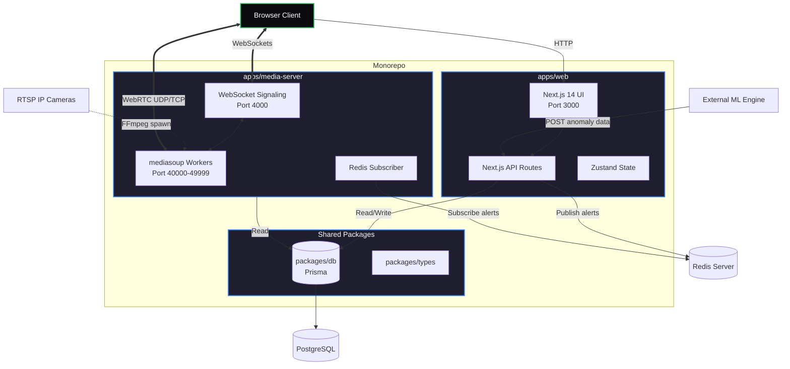

# Hostel Monitoring System - HMS.SYS

A production-grade, globally scalable monorepo for intelligent hostel surveillance. This system leverages a mediasoup Selective Forwarding Unit (SFU) architecture for real-time camera streaming with ultra-low latency, coupled with an independent Machine Learning inference webhook for autonomous threat detection and WebSocket signaling for instant tactical UI updates.

## System Architecture

The architecture separates the high-intensity WebRTC media routing from the robust Next.js command center UI. They communicate via WebSockets for state and Redis Pub/Sub for cross-service event propagation (like ML anomaly detection).



## How to Use the Project

### 1. Prerequisites
Ensure you have the following installed on your machine:
*   **Node.js**: v18 or higher.
*   **PostgreSQL**: A running instance.
*   **Redis**: A running instance (e.g., `redis-server`).
*   **C++ Build Tools**: Required for compiling the `mediasoup` native node-addon.
    *   *macOS*: `xcode-select --install`
    *   *Linux*: `sudo apt install build-essential python3`
*   **FFmpeg**: Required on the machine running the media-server to ingest RTSP streams.
    *   *macOS*: `brew install ffmpeg`
    *   *Linux*: `sudo apt install ffmpeg`

### 2. Environment Setup
Clone the repository and copy the example environment file:
```bash
git clone <repository_url>
cd hostel-monitor
cp .env.example .env
```

Update the `.env` file with your specific configurations.
**CRITICAL**: `ANNOUNCED_IP` must be set to the network IP address (e.g., `192.168.1.X`) of the machine running the `media-server` if you want to view streams from other devices on the network. If running entirely locally, `127.0.0.1` is acceptable.

### 3. Install Dependencies
Install all packages across the monorepo using npm:
```bash
npm install
```

### 4. Database Setup
Push the prisma schema to your PostgreSQL instance and run the seed script to populate mock hostels, floors, users, and dummy camera instances.
```bash
npm run db:push
npm run db:seed
```

**Default Credentials (from seed):**
*   **Email:** `admin@hostel.com`
*   **Password:** `password123`

### 5. Start the System
Use Turborepo to boot both the Next.js web application and the mediasoup media server concurrently:
```bash
npm run dev
```

*   **Web UI:** [http://localhost:3000](http://localhost:3000)
*   **Media Server HTTP Health:** [http://localhost:3001/health](http://localhost:3001/health)
*   **Media Server WebSocket:** `ws://localhost:4000`

---

## Detailed API Reference

All API routes are located within `apps/web/app/api/` and are protected by NextAuth session validation unless specified otherwise.

### Authentication

#### `POST /api/auth/[...nextauth]`
Handles authentication using the NextAuth Credentials provider.
*   **Body:** `{ "email": "admin@hostel.com", "password": "password123" }`
*   **Returns:** A valid JWT session cookie containing `{ id, name, email, role }` if successful.

### Hostels & Hierarchy

#### `GET /api/hostels`
Retrieves a summary of all mapped hostels in the system.
*   **Response:**
    ```json
    [
      {
        "id": "A",
        "name": "Hostel A",
        "floors": 15,
        "onlineCameras": 45,
        "activeAlerts": 2,
        "color": "#3b82f6"
      }
    ]
    ```

#### `GET /api/hostels/:hostelId`
Retrieves detailed information about a specific hostel, including aggregated counts for individual floors.
*   **Params:** `hostelId` (e.g., "A", "C")
*   **Response:**
    ```json
    {
      "id": "A",
      "name": "Hostel A",
      "floors": [
        {
          "id": "cuid_string",
          "number": 1,
          "cameraCount": 3,
          "activeAlertCount": 0
        }
      ]
    }
    ```

#### `GET /api/hostels/:hostelId/floors/:floorNumber/cameras`
Retrieves all tactical camera nodes deployed on a specific floor. Used by the Floor Map page to render the interactive grid.
*   **Params:** `hostelId` ("A"), `floorNumber` (1)
*   **Response:**
    ```json
    [
      {
        "id": "cuid_string",
        "label": "CAM-A-01-001",
        "posX": 20,
        "posY": 30,
        "isOnline": true,
        "description": "Near staircase",
        "unresolvedAlertsCount": 0
      }
    ]
    ```

### Camera Management

#### `GET /api/cameras/:cameraId`
Retrieves deep intel on a specific camera, including its recent incident history limit.
*   **Response:**
    ```json
    {
      "id": "cuid",
      "label": "CAM-A-01-001",
      "rtspUrl": "rtsp://...",
      "posX": 20,
      "posY": 30,
      "alerts": [ /* Array of Alert objects */ ]
    }
    ```

#### `PATCH /api/cameras/:cameraId`
Updates camera settings. **Requires SUPER_ADMIN role.**
*   **Body:** (Partial) `{ "posX": 25, "posY": 35, "description": "Relocated to corner", "rtspUrl": "rtsp://new_feed" }`
*   **Response:** Returns the updated camera object.

### ML Integration & Alerts

#### `POST /api/alerts/ml`
**Unauthenticated Webhook (Secured via API Key).** This is the entry point for the external Machine Learning inference engine to report anomalies.
*   **Headers:** `x-api-key: <process.env.ML_API_KEY>`
*   **Body:**
    ```json
    {
      "cameraId": "cuid_string",
      "alertType": "FIGHT", 
      // Allowed types: FIGHT, LIQUOR, SMOKING, ANIMAL_MONKEY, ANIMAL_DOG, UNAUTHORIZED_PERSON, WEAPON
      "severity": "CRITICAL", 
      // Allowed severities: LOW, MEDIUM, HIGH, CRITICAL
      "description": "Physical altercation detected in corridor.",
      "thumbnail": "base64_encoded_jpeg_string..." // Optional
    }
    ```
*   **Action:** 
    1. Creates a database record. 
    2. Publishes the event to the Redis `alerts` channel. The `media-server` instantly catches this and pushes a `WebSocket` broadcast to the command center UI.
*   **Response:** `{ "ok": true, "alertId": "cuid" }`

#### `GET /api/alerts`
Retrieves a paginated list of alerts. Supports filtering.
*   **Queries (Optional):** `?page=1&limit=50&hostelId=A&floorNumber=1&alertType=FIGHT&severity=CRITICAL&resolved=false`
*   **Response:**
    ```json
    {
      "alerts": [ /* Populated alert objects with nested camera/hostel relations */ ],
      "pagination": {
        "total": 12,
        "page": 1,
        "limit": 50,
        "totalPages": 1
      }
    }
    ```

#### `PATCH /api/alerts/:alertId/resolve`
Marks an active threat as resolved. Logs the operator's ID and timestamp.
*   **Response:** Returns the updated alert object. 

---

## WebSocket Signaling Reference

While not HTTP APIs, the `media-server` communicates via JSON over WebSockets (`ws://localhost:4000`) defining the SFU operational layer.

*   `JOIN_FLOOR`: Browser submits `{ hostelId, floorNumber }`. Server answers with active stream topologies.
*   `GET_ROUTER_RTP_CAPABILITIES`: Browser asks for server codec support.
*   `CREATE_RECV_TRANSPORT`: Setup DTLS/ICE pathways for WebRTC.
*   `CONSUME` / `RESUME_CONSUMER`: Client asks to pipe a specific `producerId` video stream to their local UI.
*   `ALERT`: (Server pushing to Client) Triggered via Redis. UI shows Sonner Toast notification.
*   `PRODUCER_ADDED` / `PRODUCER_REMOVED`: Live topological updates when cameras go offline or when new FFmpeg feeds boot up.
